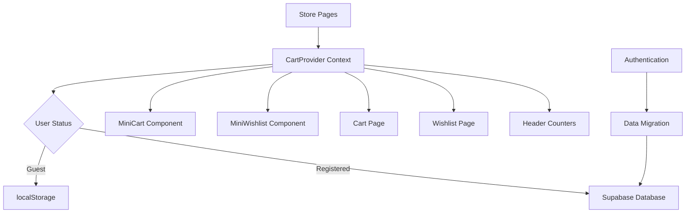
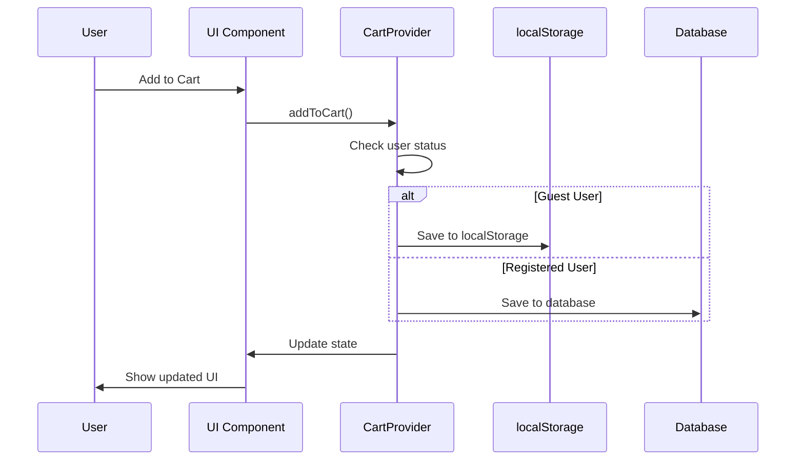
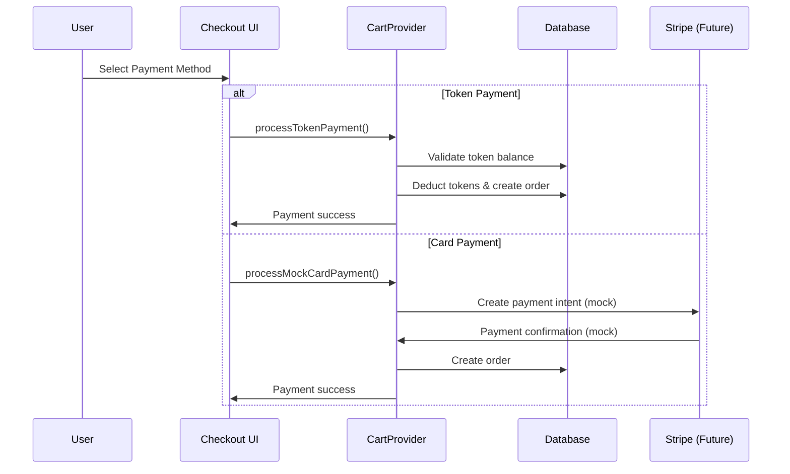

# Design Document

## Overview

The ecommerce system is built around a dual-storage architecture that seamlessly handles both guest users (localStorage) and registered users (database). The system uses React Context for state management and provides real-time synchronization across all UI components.

## Architecture

### High-Level Architecture



### Data Flow Architecture



## Components and Interfaces

### CartProvider Context

**Purpose:** Central state management for cart and wishlist operations

**Key Methods:**
- `addToCart(product)` - Add product to cart
- `removeFromCart(productId)` - Remove product from cart
- `updateQuantity(productId, quantity)` - Update item quantity
- `addToWishlist(product)` - Add product to wishlist
- `removeFromWishlist(productId)` - Remove from wishlist
- `clearCart()` - Empty the cart
- `getCartTotal()` - Calculate total cost in tokens
- `getCartTotalUSD()` - Calculate total cost in USD
- `getCartItemsCount()` - Get total item count
- `migrateGuestData()` - Migrate localStorage to database
- `processTokenPayment()` - Handle token-based checkout
- `processMockCardPayment()` - Handle mock card payment (Stripe ready)

**State Structure:**
```typescript
interface CartState {
  cart: CartItem[]
  wishlist: WishlistItem[]
  loading: boolean
  error: string | null
}

interface CartItem {
  product_id: string
  name: string
  price_tokens: number
  price_usd: number // USD equivalent for card payments
  quantity: number
  image?: string
  category?: string
}

interface WishlistItem {
  product_id: string
  name: string
  price_tokens: number
  price_usd: number // USD equivalent for card payments
  image?: string
  category?: string
}
```

### Database Schema

**Cart Items Table (ecommerce_carts):**
```sql
CREATE TABLE ecommerce_carts (
  id UUID DEFAULT gen_random_uuid() PRIMARY KEY,
  user_id UUID REFERENCES user_profiles(id) ON DELETE CASCADE,
  product_id UUID REFERENCES products(id) ON DELETE CASCADE,
  quantity INTEGER NOT NULL DEFAULT 1,
  added_at TIMESTAMP WITH TIME ZONE DEFAULT NOW(),
  UNIQUE(user_id, product_id)
);
```

**Wishlist Table (ecommerce_wishlists):**
```sql
CREATE TABLE ecommerce_wishlists (
  id UUID DEFAULT gen_random_uuid() PRIMARY KEY,
  user_id UUID REFERENCES user_profiles(id) ON DELETE CASCADE,
  product_id UUID REFERENCES products(id) ON DELETE CASCADE,
  added_at TIMESTAMP WITH TIME ZONE DEFAULT NOW(),
  UNIQUE(user_id, product_id)
);
```

**Orders Table (ecommerce_orders):**
```sql
CREATE TABLE ecommerce_orders (
  id UUID DEFAULT gen_random_uuid() PRIMARY KEY,
  user_id UUID REFERENCES user_profiles(id) ON DELETE CASCADE,
  total_tokens INTEGER NOT NULL,
  total_usd DECIMAL(10,2), -- For card payments
  payment_method VARCHAR(20) NOT NULL, -- 'tokens' or 'card'
  payment_status VARCHAR(50) DEFAULT 'pending', -- 'pending', 'completed', 'failed'
  stripe_payment_intent_id VARCHAR(255), -- For Stripe integration
  status VARCHAR(50) DEFAULT 'processing', -- 'processing', 'completed', 'cancelled'
  created_at TIMESTAMP WITH TIME ZONE DEFAULT NOW()
);

CREATE TABLE ecommerce_order_items (
  id UUID DEFAULT gen_random_uuid() PRIMARY KEY,
  order_id UUID REFERENCES ecommerce_orders(id) ON DELETE CASCADE,
  product_id UUID REFERENCES products(id) ON DELETE CASCADE,
  quantity INTEGER NOT NULL,
  price_tokens INTEGER NOT NULL,
  price_usd DECIMAL(10,2) -- USD equivalent for card payments
);
```

### UI Components

**MiniCart Component:**
- Hover-triggered dropdown from header
- Shows first 3-4 items with quantities
- Quick quantity adjustment controls
- Total cost display (tokens + USD equivalent)
- Links to full cart page

**MiniWishlist Component:**
- Hover-triggered dropdown from header
- Shows first 3-4 wishlist items
- Quick "Add to Cart" buttons
- Links to full wishlist page

**Cart Page:**
- Full cart management interface
- Quantity controls for each item
- Remove item functionality
- Order summary with totals (tokens + USD)
- Payment method selection (tokens vs card)
- Checkout process integration

**Checkout Component:**
- Payment method selection
- Token balance validation
- Mock credit card form (prepared for Stripe)
- Order confirmation
- Success/error handling

**Wishlist Page:**
- Grid layout of wishlist items
- Move to cart functionality
- Remove from wishlist options
- Product details and pricing

## Payment System

### Payment Methods

**Token Payments:**
- Direct deduction from user token balance
- Instant processing
- No external dependencies
- Integrated with existing token system

**Card Payments (Mock/Stripe Ready):**
- Mock credit card processing for development
- Stripe integration structure prepared
- USD pricing with token equivalent display
- Payment intent creation and confirmation flow

### Payment Flow



### Mock Payment Implementation

**Development Phase:**
- Simulated card validation
- Mock payment processing delays
- Success/failure scenarios for testing
- Stripe-compatible data structures

**Production Ready:**
- Easy Stripe integration swap
- Environment-based payment switching
- Secure payment token handling
- Webhook integration for payment confirmations

## Data Models

### Storage Strategy

**Guest Users (localStorage):**
```typescript
// localStorage keys
const CART_STORAGE_KEY = 'red_mafia_cart'
const WISHLIST_STORAGE_KEY = 'red_mafia_wishlist'

// Data structure matches database format for easy migration
interface LocalStorageCart {
  items: CartItem[]
  lastUpdated: string
}
```

**Registered Users (Database):**
- Real-time synchronization with Supabase
- Row Level Security (RLS) policies
- Automatic cleanup on user deletion
- Optimistic updates with rollback on failure

### Data Migration Strategy

**Guest to Registered User:**
1. Detect user authentication change
2. Load existing localStorage data
3. Merge with any existing database data
4. Save merged data to database
5. Clear localStorage
6. Update UI state

**Conflict Resolution:**
- If same product exists in both localStorage and database, keep higher quantity
- Preserve most recent timestamps
- Maintain user preferences from database

## Error Handling

### Database Operation Errors

**Connection Issues:**
- Fallback to localStorage for temporary storage
- Queue operations for retry when connection restored
- Show user-friendly offline indicators

**Constraint Violations:**
- Handle duplicate product additions gracefully
- Merge quantities instead of failing
- Provide clear error messages

**Permission Errors:**
- Redirect to login if authentication expires
- Preserve cart state during re-authentication
- Resume operations after successful login

### UI Error States

**Loading States:**
- Skeleton loaders for cart/wishlist items
- Spinner indicators for operations
- Disabled states during processing

**Error Messages:**
- Toast notifications for operation results
- Inline validation for form inputs
- Clear recovery instructions

## Testing Strategy

### Unit Testing

**CartProvider Tests:**
- State management operations
- localStorage integration
- Database operation mocking
- Error handling scenarios

**Component Tests:**
- User interaction flows
- State synchronization
- Error state rendering
- Loading state behavior

### Integration Testing

**Database Integration:**
- CRUD operations for cart/wishlist
- RLS policy enforcement
- Data migration scenarios
- Concurrent user operations

**Authentication Integration:**
- Guest to registered user flow
- Data persistence across sessions
- Token balance validation
- Checkout process integration

### End-to-End Testing

**User Workflows:**
- Complete shopping journey (browse → cart → checkout)
- Cross-device synchronization
- Offline/online state transitions
- Error recovery scenarios

**Performance Testing:**
- Large cart/wishlist handling
- Concurrent user load testing
- Database query optimization
- UI responsiveness under load