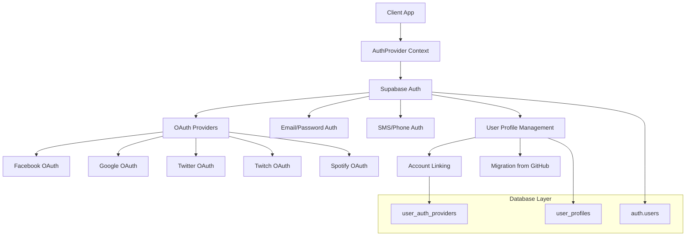
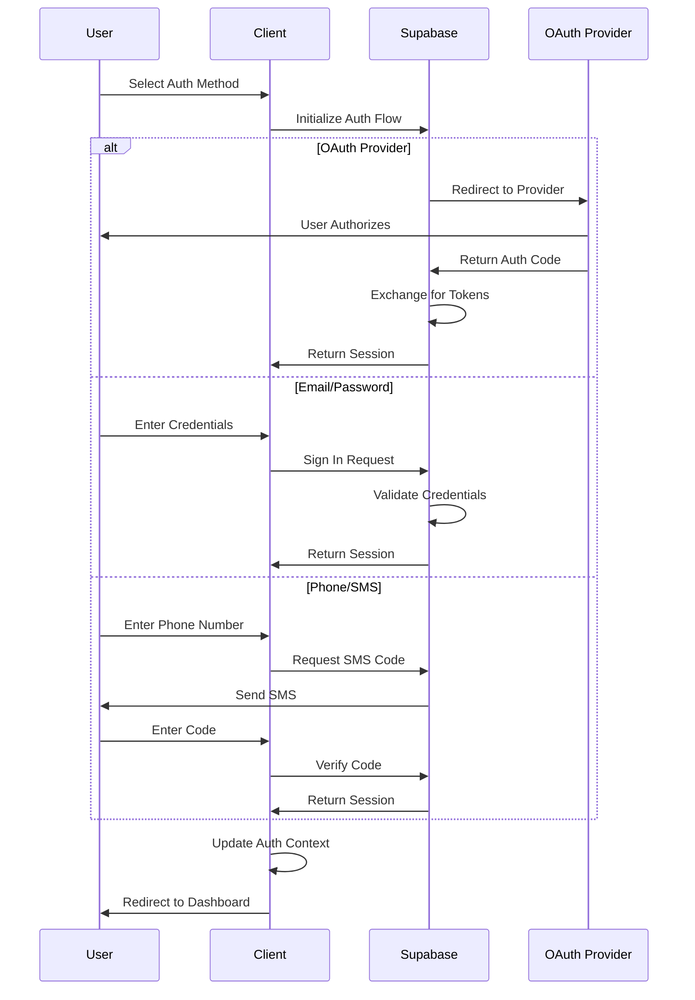

# Design Document

## Overview

Este diseño implementa un sistema de autenticación completo para la plataforma musical, reemplazando GitHub con proveedores más relevantes para la audiencia musical. La solución utiliza Supabase Auth como base, aprovechando su infraestructura OAuth robusta y agregando autenticación por SMS para usuarios móviles.

El sistema mantendrá la arquitectura existente de AuthProvider/AuthContext mientras expande las opciones de autenticación y mejora la experiencia del usuario con interfaces específicas para cada proveedor.

## Architecture

### High-Level Architecture



### Authentication Flow



## Components and Interfaces

### 1. Enhanced AuthProvider

**Location:** `components/providers/AuthProvider.tsx`

**Responsibilities:**
- Manage authentication state for all providers
- Handle provider-specific user data
- Manage account linking and migration
- Provide unified interface for all auth methods

**Key Methods:**
```typescript
interface AuthContextType {
  // Existing
  user: User | null;
  session: Session | null;
  profile: UserProfile | null;
  loading: boolean;
  signOut: () => Promise<void>;
  
  // New additions
  signInWithProvider: (provider: AuthProvider) => Promise<void>;
  signInWithPhone: (phone: string) => Promise<void>;
  verifyPhoneCode: (code: string) => Promise<void>;
  linkAccount: (provider: AuthProvider) => Promise<void>;
  unlinkAccount: (provider: AuthProvider) => Promise<void>;
  getLinkedProviders: () => AuthProvider[];
}

type AuthProvider = 'google' | 'facebook' | 'twitter' | 'twitch' | 'spotify';
```

### 2. Provider-Specific Components

**Location:** `components/auth/providers/`

Each provider will have its own component with custom styling and behavior:

- `GoogleAuthButton.tsx` - Google OAuth with proper branding
- `FacebookAuthButton.tsx` - Facebook OAuth with FB blue styling
- `TwitterAuthButton.tsx` - Twitter OAuth with Twitter branding
- `TwitchAuthButton.tsx` - Twitch OAuth with purple Twitch styling
- `SpotifyAuthButton.tsx` - Spotify OAuth with green Spotify styling
- `PhoneAuthForm.tsx` - Phone number input and SMS verification

### 3. Enhanced Login/Register Pages

**Location:** `app/login/page.tsx`, `app/registro/page.tsx`

**Features:**
- Remove GitHub button
- Add new provider buttons with proper styling
- Add phone authentication option
- Improved error handling for each provider
- Progressive enhancement for mobile users

### 4. Account Management Component

**Location:** `components/auth/AccountManagement.tsx`

**Features:**
- Display linked authentication methods
- Add/remove authentication providers
- Handle account migration from GitHub
- Security settings for each provider

### 5. Migration Utility

**Location:** `lib/auth/migration.ts`

**Purpose:** Handle migration of existing GitHub users to alternative providers

## Data Models

### Enhanced User Profile Schema

```sql
-- Add provider tracking to existing user_profiles table
ALTER TABLE user_profiles ADD COLUMN IF NOT EXISTS auth_providers JSONB DEFAULT '[]';
ALTER TABLE user_profiles ADD COLUMN IF NOT EXISTS primary_auth_method VARCHAR(50) DEFAULT 'email';
ALTER TABLE user_profiles ADD COLUMN IF NOT EXISTS phone_number VARCHAR(20);
ALTER TABLE user_profiles ADD COLUMN IF NOT EXISTS phone_verified BOOLEAN DEFAULT FALSE;

-- New table for tracking authentication providers
CREATE TABLE IF NOT EXISTS user_auth_providers (
  id UUID PRIMARY KEY DEFAULT gen_random_uuid(),
  user_id UUID REFERENCES auth.users(id) ON DELETE CASCADE,
  provider VARCHAR(50) NOT NULL,
  provider_user_id VARCHAR(255),
  provider_data JSONB,
  linked_at TIMESTAMP WITH TIME ZONE DEFAULT NOW(),
  last_used_at TIMESTAMP WITH TIME ZONE,
  is_primary BOOLEAN DEFAULT FALSE,
  UNIQUE(user_id, provider)
);

-- Migration tracking table
CREATE TABLE IF NOT EXISTS auth_migrations (
  id UUID PRIMARY KEY DEFAULT gen_random_uuid(),
  user_id UUID REFERENCES auth.users(id) ON DELETE CASCADE,
  from_provider VARCHAR(50) NOT NULL,
  to_provider VARCHAR(50) NOT NULL,
  migrated_at TIMESTAMP WITH TIME ZONE DEFAULT NOW(),
  migration_data JSONB
);
```

### Provider Configuration

```typescript
interface ProviderConfig {
  name: string;
  displayName: string;
  icon: React.ComponentType;
  color: string;
  scopes?: string[];
  additionalParams?: Record<string, string>;
}

const PROVIDER_CONFIGS: Record<AuthProvider, ProviderConfig> = {
  google: {
    name: 'google',
    displayName: 'Google',
    icon: FiChrome,
    color: '#4285f4',
    scopes: ['email', 'profile']
  },
  facebook: {
    name: 'facebook',
    displayName: 'Facebook',
    icon: FiFacebook,
    color: '#1877f2',
    scopes: ['email', 'public_profile']
  },
  // ... other providers
};
```

## Error Handling

### Provider-Specific Error Handling

```typescript
interface AuthError {
  provider: AuthProvider | 'email' | 'phone';
  code: string;
  message: string;
  userMessage: string;
  retryable: boolean;
  suggestedActions: string[];
}

const ERROR_MAPPINGS = {
  // OAuth errors
  'oauth_access_denied': {
    userMessage: 'Acceso denegado. Intenta con otro método.',
    retryable: true,
    suggestedActions: ['Usar email/contraseña', 'Intentar otro proveedor']
  },
  'oauth_server_error': {
    userMessage: 'Servicio temporalmente no disponible.',
    retryable: true,
    suggestedActions: ['Reintentar en unos minutos', 'Usar método alternativo']
  },
  // Phone errors
  'phone_invalid': {
    userMessage: 'Número de teléfono inválido.',
    retryable: true,
    suggestedActions: ['Verificar formato del número']
  },
  'sms_rate_limit': {
    userMessage: 'Demasiados intentos. Espera antes de solicitar otro código.',
    retryable: false,
    suggestedActions: ['Esperar 5 minutos', 'Usar email/contraseña']
  }
};
```

### Fallback Strategies

1. **Provider Unavailable:** Suggest alternative providers
2. **Network Issues:** Retry mechanism with exponential backoff
3. **Rate Limiting:** Clear messaging and alternative options
4. **Account Conflicts:** Guided account linking flow

## Testing Strategy

### Unit Tests

**Location:** `__tests__/auth/`

**Coverage:**
- AuthProvider context functionality
- Provider-specific authentication flows
- Error handling for each provider
- Account linking/unlinking logic
- Migration utilities

**Key Test Cases:**
```typescript
describe('AuthProvider', () => {
  test('should handle Google OAuth flow', async () => {
    // Test Google authentication
  });
  
  test('should handle phone authentication', async () => {
    // Test SMS flow
  });
  
  test('should link multiple providers', async () => {
    // Test account linking
  });
  
  test('should migrate from GitHub', async () => {
    // Test migration flow
  });
});
```

### Integration Tests

**Location:** `__tests__/integration/auth/`

**Coverage:**
- End-to-end authentication flows
- Provider callback handling
- Database operations
- Session management

### E2E Tests

**Location:** `e2e/auth/`

**Coverage:**
- Complete user registration flows
- Login with each provider
- Account management workflows
- Error scenarios

## Implementation Phases

### Phase 1: Infrastructure Setup
- Configure new OAuth providers in Supabase
- Update database schema
- Create provider configuration system

### Phase 2: Core Authentication
- Implement enhanced AuthProvider
- Create provider-specific components
- Update login/register pages

### Phase 3: Account Management
- Build account linking functionality
- Create account management interface
- Implement security features

### Phase 4: Migration & Cleanup
- Create GitHub migration utility
- Remove GitHub references
- Update documentation

### Phase 5: Testing & Polish
- Comprehensive testing
- Error handling improvements
- Performance optimization
- User experience enhancements

## Security Considerations

### OAuth Security
- Use PKCE for all OAuth flows
- Validate state parameters
- Secure token storage
- Regular token refresh

### Phone Authentication
- Rate limiting for SMS requests
- Code expiration (5 minutes)
- Attempt limiting (3 tries per code)
- Phone number validation

### Account Linking
- Require re-authentication for linking
- Prevent account takeover scenarios
- Audit trail for account changes
- Email notifications for security events

### Data Protection
- Minimal data collection from providers
- Secure storage of provider tokens
- Regular cleanup of expired sessions
- GDPR compliance for user data

## Performance Considerations

### Optimization Strategies
- Lazy loading of provider SDKs
- Caching of provider configurations
- Optimized bundle splitting
- Progressive enhancement for mobile

### Monitoring
- Authentication success/failure rates
- Provider-specific performance metrics
- Error tracking and alerting
- User experience analytics